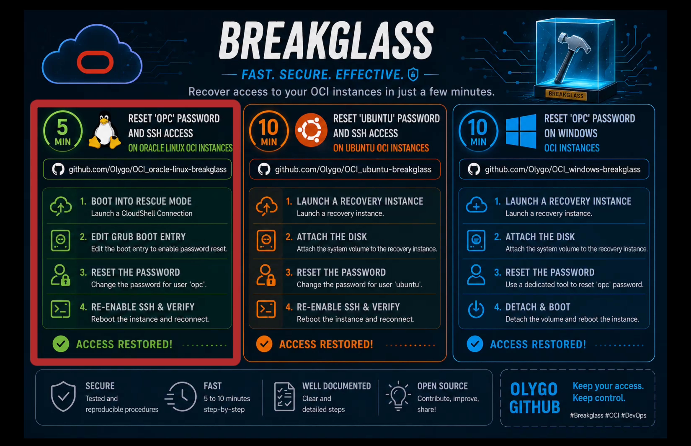

# Reset Root Password and SSH Access on Oracle Linux OCI Instances in 5 minutes

This guide explains how to reset the `root` and `opc` passwords, and replace `SSH public keys` on Oracle Linux instances running in OCI.

This procedure specifically applies to the **Oracle Linux images provided by OCI** because those images expose and allow access to the **GRUB boot menu** from the OCI serial console.

***Read the following runbook and [watch the video demonstration](https://olygo.objectstorage.eu-frankfurt-1.oci.customer-oci.com/p/14mPdhnQ6olZKlzn6CvXBIw6G1DCTHLJBNL6HavQrbVMMZurigR6sp50V_-0E1cZ/n/olygo/b/github_reset_linux/o/reset_OL_ssh.mp4)***

[](https://olygo.objectstorage.eu-frankfurt-1.oci.customer-oci.com/p/14mPdhnQ6olZKlzn6CvXBIw6G1DCTHLJBNL6HavQrbVMMZurigR6sp50V_-0E1cZ/n/olygo/b/github_reset_linux/o/reset_OL_ssh.mp4)

# Important Notes

- This procedure requires the following permissions 
	- Manage the instance
	- Use Cloud Shell 
- This procedure was tested on:
  - Oracle Linux 8
  - Oracle Linux 9
- The instance filesystem remains intact.
- No data loss occurs if the procedure is followed correctly.

- **ALWAYS BACKUP YOUR INSTANCE BEFORE SUCH PROCEDURES**

# Step 1 - Open a Serial Console Connection

From the OCI Console:

1. Open:
   - `Compute` => `Instances` => `your instance` => `OS Management` => `Console connection`
2. Launch a `Cloud Shell connection`

This gives direct serial console access to the VM.

# Step 2 - Force Reboot the Instance

To access GRUB, the instance must reboot while the serial console is attached.

If the Grub menu is not displayed `Force Reboot Instance`

# Step 3 - Edit the GRUB Boot Entry

When the GRUB menu appears:

Select the default Oracle Linux kernel entry and `Press e` to edit the boot configuration.

Locate the line beginning with:

```
linux ($root)/vmlinuz...
```

Replace the following parameter:

```
ro
```

with:

```
rw init=/sysroot/bin/sh
```

`Press Ctrl + x` to boot
 
`rw` will mount the root filesystem in read/write mode.

- Without this, password and SSH key modifications cannot be saved.

`init=/sysroot/bin/sh` will give immediate root-level access without authentication.

- Instead of booting systemd normally, Linux launches a shell directly from the system root filesystem.

# Step 4 - Enter the Real Root Filesystem

Run:

```
chroot /sysroot
```

*The shell currently runs from the initramfs rescue environment.*

`chroot /sysroot` *switches into the actual installed Oracle Linux system so all commands affect the real OS.*

# Step 5 - Reset Passwords

Reset the `root` and `opc` passwords

```
passwd root
passwd opc
```

# Step 6 - Replace or Add SSH Public Keys

Edit the authorized keys file:

```
vi /home/opc/.ssh/authorized_keys
```

# Step 7 - Enforce ssh permissions

```
chmod 700 /home/opc/.ssh
chmod 600 /home/opc/.ssh/authorized_keys
chown -R opc:opc /home/opc/.ssh
```

**SSH is extremely strict about permissions.**

- Only the owner can access the .ssh directory.
- Only the owner can read/write the key file.
- Ensures the opc user owns all SSH files.

*Incorrect permissions will cause SSH login failures.*

# Step 8 - Trigger SELinux Relabel

```
touch /.autorelabel
```

**Oracle Linux uses SELinux.**

When modifying SSH files or passwords outside normal boot, SELinux contexts may become invalid.

Creating `/.autorelabel` forces SELinux to relabel files correctly during the next boot.

Without this step:

- SSH authentication may fail
- authorized_keys may be ignored
- Login may be denied even with correct credentials

# Step 9 - Flush Filesystem Changes

```
sync && sleep 10
```

`sync` **flushes all pending filesystem writes to disk.**

`sleep 10` **provides additional time for storage synchronization, especially useful on:**

- OCI block volumes
- iSCSI-backed storage
- LVM environments

This reduces the risk of corruption or incomplete writes before rebooting.

# Step 10 - Exit the chroot Environment

```
exit
```

# Step 11 - Unmount the Root Filesystem

```
umount -l /sysroot
```

`umount` **unmounts the real root filesystem cleanly.**

`-l` **performs a lazy unmount.**

This avoids failures caused by lingering file handles inside initramfs.

Although optional, this is considered cleaner before rebooting.

# Step 12 - Reboot the Instance

```
reboot -f
```

# First Boot Warning

**The first reboot may take several minutes.**

This is normal because SELinux performs a complete filesystem relabel operation triggered by:

```
touch /.autorelabel
```

**DO NOT INTERRUPT THE BOOT PROCESS.**

# Full Command Summary

```
rw init=/sysroot/bin/sh

chroot /sysroot

passwd root
passwd opc

vi /home/opc/.ssh/authorized_keys

chmod 700 /home/opc/.ssh
chmod 600 /home/opc/.ssh/authorized_keys
chown -R opc:opc /home/opc/.ssh

touch /.autorelabel

sync && sleep 10

exit

umount -l /sysroot

reboot -f
```

## Contact

[github@olygo.com](mailto:github@olygo.com)