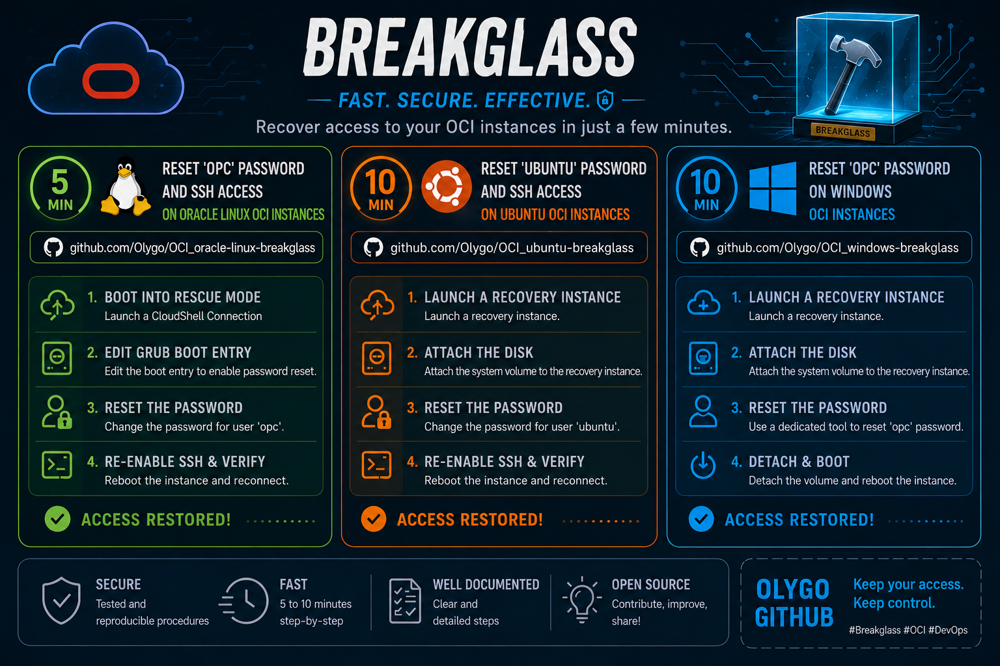

|................. Oracle Linux .................|.................... Ubuntu ....................|................... Windows ...................|
|---|---|---|
| [Read the Runbook](./Oracle-Linux.md) | [Read the Runbook](./Ubuntu.md) | [Read the Runbook](./Windows.md) |
| [Watch the video](https://olygo.objectstorage.eu-frankfurt-1.oci.customer-oci.com/p/14mPdhnQ6olZKlzn6CvXBIw6G1DCTHLJBNL6HavQrbVMMZurigR6sp50V_-0E1cZ/n/olygo/b/github_reset_linux/o/reset_OL_ssh.mp4) | [Watch the video](https://olygo.objectstorage.eu-frankfurt-1.oci.customer-oci.com/p/fDDY0TzvqCbP-H5en83xyWxXnGotyjUd8IsyKwOH974_qx_z_YXRlHfkwI_9HNLS/n/olygo/b/github_reset_linux/o/Reset_Ubuntu.mp4) | [Watch the video](https://olygo.objectstorage.eu-frankfurt-1.oci.customer-oci.com/p/QVAUGApYS6hRYitQL5UWXAcj3Y5x2qM8Z3slPLvOjVHxm5ELcjaD9tE2Ibnrgbx4/n/olygo/b/github_reset_linux/o/Reset_Windows.mp4) |
