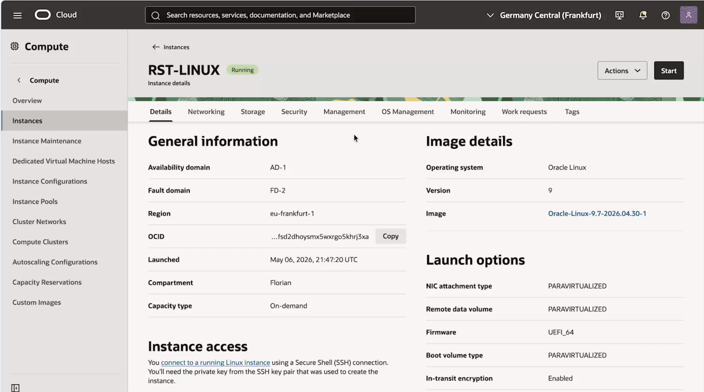

# Reset Root Password and SSH Access on Ubuntu OCI Instances in 10 minutes

This guide explains how to reset the `root` and `ubuntu` passwords, and replace `SSH public keys` on Ubuntu instances running in OCI.

This procedure specifically applies to the **Ubuntu images provided by OCI** because those images do not expose and allow access to the **GRUB boot menu** from the OCI serial console.

***Read the following runbook and [watch the video demonstration](https://olygo.objectstorage.eu-frankfurt-1.oci.customer-oci.com/p/fDDY0TzvqCbP-H5en83xyWxXnGotyjUd8IsyKwOH974_qx_z_YXRlHfkwI_9HNLS/n/olygo/b/github_reset_linux/o/Reset_Ubuntu.mp4)***

[](https://olygo.objectstorage.eu-frankfurt-1.oci.customer-oci.com/p/fDDY0TzvqCbP-H5en83xyWxXnGotyjUd8IsyKwOH974_qx_z_YXRlHfkwI_9HNLS/n/olygo/b/github_reset_linux/o/Reset_Ubuntu.mp4)

# Important Notes

- This procedure requires the following permissions
	- Manage the instance
	- Manage boot and block volumes
	- Launch instances
- This procedure was tested on:
  - Ubuntu 24.x
- The instance filesystem remains intact.
- No data loss occurs if the procedure is followed correctly.

- **ALWAYS BACKUP YOUR INSTANCE BEFORE SUCH PROCEDURES**

- `Recovery_Instance` is the instance used to recover and update the SSH keys
- `Source_Instance` is the original instance for which SSH access has been lost.
 
# Step 1 - Launch a recovery Ubuntu instance

The `Recovery_Instance` will be used to attach the `Source_Instance` boot volume.

- This instance can use any OCI shape
- It can be attached to any VCN, even a temporary and isolated VCN
- However it **MUST BE LAUNCHED IN THE SAME REGION AND AVAILABILITY DOMAIN** as the `Source_Instance`.
	-	Otherwise you will not be able to attach the Boot Volume

# Step 2 - Prepare the Ubuntu Source_Instance

1. [Stop the Ubuntu Source_Instance](https://docs.oracle.com/en-us/iaas/Content/Compute/Tasks/restartinginstance-stop-instance.htm)
2. [Backup the Boot Volume](https://docs.oracle.com/en-us/iaas/Content/Block/Tasks/create-bv-boot-volume-backup.htm)
3. [Detach the Boot Volume](https://docs.oracle.com/en-us/iaas/Content/Block/Tasks/detach-compute-boot-volume-attachment.htm)

# Step 3 - Attach boot volume

- Attach the `Source_Instance` boot volume as block volume to the `Recovery_Instance`
- Attachment type must be `PARAVIRTUALIZED`

# Step 4 - SSH into the Recovery_Instance

## Identify disks

```
lsblk
```

`sda` should be the boot volume of the `Recovery_Instance`

`sdb` should be the boot volume of the `Source_Instance`

## Identify partitions

```
sudo blkid /dev/sdb1 /dev/sdb15 /dev/sdb16
```

`sdb1` should be the `root partition`

`sdb15` should be the `EFI partition`

`sdb16` should be the `boot partition`

## Mount partitions

```
sudo mkdir -p /mnt/recovery
sudo mount /dev/sdb1 /mnt/recovery

sudo mkdir -p /mnt/recovery/boot
sudo mount /dev/sdb16 /mnt/recovery/boot

sudo mkdir -p /mnt/recovery/boot/efi
sudo mount /dev/sdb15 /mnt/recovery/boot/efi
```

## Bind mounts

```
sudo mount --bind /dev /mnt/recovery/dev
sudo mount --bind /proc /mnt/recovery/proc
sudo mount --bind /sys /mnt/recovery/sys
sudo mount --bind /run /mnt/recovery/run
```

## Verify mounts

```
mount | grep recovery
```

## Enter chroot

```
sudo chroot /mnt/recovery
```

## Reset root & ubuntu passwords

```
passwd root
passwd ubuntu
```

## Reset ubuntu ssh keys

```
vi /home/ubuntu/.ssh/authorized_keys
```

## Enforce ssh permissions

```
chmod 700 /home/ubuntu/.ssh
chmod 600 /home/ubuntu/.ssh/authorized_keys
chown -R ubuntu:ubuntu /home/ubuntu/.ssh
```

**SSH is extremely strict about permissions.**

- Only the owner can access the .ssh directory.
- Only the owner can read/write the key file.
- Ensures the opc user owns all SSH files.

*Incorrect permissions will cause SSH login failures.*

## Verify ssh permissions

```
ls -ld /home/ubuntu/.ssh
ls -l /home/ubuntu/.ssh/authorized_keys
```

## Flush Filesystem Changes

```
sync && sleep 10
```

`sync` **flushes all pending filesystem writes to disk.**

`sleep 10` **provides additional time for storage synchronization, especially useful on:**

- OCI block volumes
- iSCSI-backed storage
- LVM environments

This reduces the risk of corruption or incomplete writes before rebooting.

## Exit chroot

```
exit
```

## Unmount partitions

```
sudo umount /mnt/recovery/dev
sudo umount /mnt/recovery/proc
sudo umount /mnt/recovery/sys
sudo umount /mnt/recovery/run
sudo umount /mnt/recovery/boot/efi
sudo umount /mnt/recovery/boot
sudo umount /mnt/recovery
```

# Step 5 - Detach boot volume

- Detach the `Source_Instance` boot volume from the `Recovery_Instance`
- You can now terminate the `Recovery_Instance`


# Step 6 - Attach boot volume

- Attach the boot volume to the `Source_Instance`
- Start the `Source_Instance`
- Connect through SSH

```
ssh ./my_new_ssh_key.priv ubuntu@source_instance_ip
```

## Contact

[github@olygo.com](mailto:github@olygo.com)