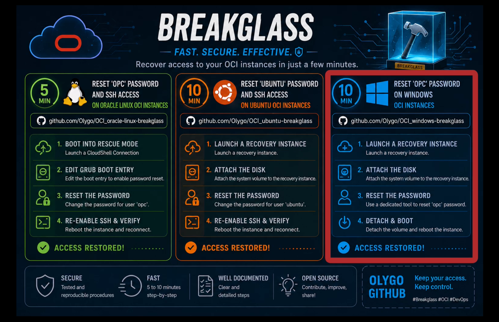

# Reset 'opc' Password on Windows OCI Instances in 10 minutes

This guide explains how to reset the `opc` password on Windows instances running in OCI.

***Read the following runbook and [watch the video demonstration](https://olygo.objectstorage.eu-frankfurt-1.oci.customer-oci.com/p/QVAUGApYS6hRYitQL5UWXAcj3Y5x2qM8Z3slPLvOjVHxm5ELcjaD9tE2Ibnrgbx4/n/olygo/b/github_reset_linux/o/Reset_Windows.mp4)***

[](https://olygo.objectstorage.eu-frankfurt-1.oci.customer-oci.com/p/QVAUGApYS6hRYitQL5UWXAcj3Y5x2qM8Z3slPLvOjVHxm5ELcjaD9tE2Ibnrgbx4/n/olygo/b/github_reset_linux/o/Reset_Windows.mp4)

# Important Notes

- This procedure requires the following permissions 
	- Manage the instance
	- Manage boot and block volumes
	- Launch instances
- It was tested on :
  - Windows 2012
  - Windows 2016
  - Windows 2019
  - Windows 2022
  - Windows 2025
- The instance filesystem remains intact.
- No data loss occurs if the procedure is followed correctly.

- **ALWAYS BACKUP YOUR INSTANCE BEFORE SUCH PROCEDURES**

# Step 1 - Launch a recovery Ubuntu instance

- This instance will be used to attach the Windows Boot Volume and remove the local account password using [CHNTPW - Offline NT Password & Registry Editor](http://www.chntpw.com/download/)

- This instance can use any OCI shape
- It can be attached to any VCN, even a temporary and isolated VCN
- However it **MUST BE LAUNCHED IN THE SAME REGION AND AVAILABILITY DOMAIN** as the Windows Instance.
	-	Otherwise you will not be able to attach the Boot Volume

# Step 2 - Prepare the Windows Instance

From the Windows Instance:

1. [Stop the Windows compute instance](https://docs.oracle.com/en-us/iaas/Content/Compute/Tasks/restartinginstance-stop-instance.htm)
2. [Backup the Boot Volume](https://docs.oracle.com/en-us/iaas/Content/Block/Tasks/create-bv-boot-volume-backup.htm)
3. [Detach the Boot Volume](https://docs.oracle.com/en-us/iaas/Content/Block/Tasks/detach-compute-boot-volume-attachment.htm)

# Step 3 - Attach Windows Boot Volume to Ubuntu Instance

From the Ubuntu Instance:

1. Attach the Windows Boot Volume as Block Volume
2. Attach using `PARAVIRTUALIZED` attachment type

# Step 4 - Remove 'opc' password

## Connect to your Ubuntu Recovery instance through SSH

- Install [CHNTPW - Offline NT Password & Registry Editor](http://www.chntpw.com/download/)

```
sudo apt update -y
sudo apt install chntpw -y
```

## Identify the Windows Boot Volume

```
lsblk
```

It should be `sdb`

## Identify the Windows Partition

```
sudo sfdisk -l /dev/sdb
```

This will list all the partitions on the boot volume

Search for `Microsoft Basic Data`, it should be on `/dev/sdb4`

## Check NTFS filesystem

```
sudo ntfsfix /dev/sdb4
```

## Mount Windows Partition

```
sudo mkdir -p /mnt/windows
sudo mount /dev/sdb4 /mnt/windows
```

## Remove 'opc' password

```
sudo chntpw /mnt/windows/Windows/System32/config/SAM -u opc
```

- `Press 1` to clear the password
- `Press 2`to unlock and enable the account
- `Press q` to quit
- `Press y` to write changes

## Edit Registry to allow blank password

```
sudo chntpw -e /mnt/windows/Windows/System32/config/SYSTEM
cd ControlSet001\Control\Lsa
ed LimitBlankPasswordUse
0x0
q
y
```

- This will edit the `LimitBlankPasswordUse` key and replace `0x1` value with `0x0`
- `Press q` to quit and `Press y` to write changes.

## Unmount Windows Partition

```
sudo umount /dev/sdb4 /mnt/windows
exit
```

# Step 5 - Detach Windows Boot Volume from Ubuntu Instance

From the Ubuntu Instance in the OCI Console:

1. Detach the Windows Boot Volume in the Attached Block Volumes list
2. You can now terminate the Ubuntu Recovery Instance

# Step 6 - Attach Windows Boot Volume to the Windows Instance

From the Windows Instance in the OCI Console:

1. Go to `Storage` => `Boot volume` => `Attach boot volume`

**=================================================================================**

**NEVER EVER START THE INSTANCE IF YOUR VCN SECURITY LIST / NSGs ALLOW RDP FROM ANY PUBLIC IP.**

**FIRST RESTRICT RDP ACCESS TO A SINGLE IP, AS THIS WINDOWS INSTANCE NO LONGER HAS A PASSWORD**

**=================================================================================**

2. Start the Windows instance

# Step 7 - Connect to the Windows Instance via RDP

- Authenticate with `opc` account with a `blank` password

## Prevent Blank password use

- Edit `Registry` to prevent Blank password use.

```
regedit
HKEY_LOCAL_MACHINE\CurrentControlSet\Control\Lsa
Edit value of LimitBlankPasswordUse
Replace value '0' with '1'
```

- Close regedit

## Reset 'opc' password

```
net user opc "New_Password"
```